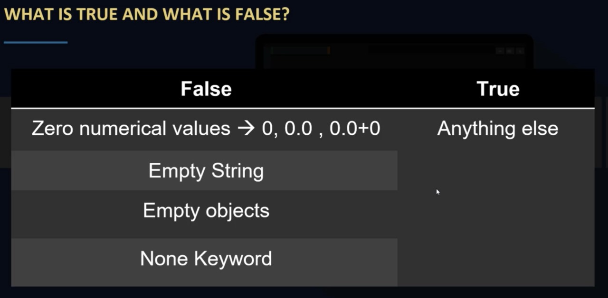
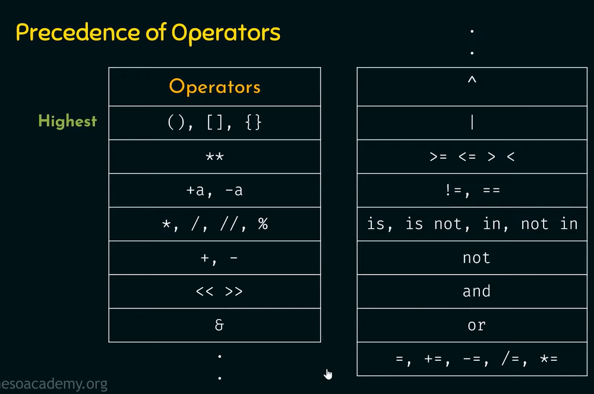

# Python

# Line Structure in Python
>口 Python code is divided into __logical lines__.

>口 Every line is ended by a token called newline.(i.e) Python uses new lines to complete a command.\
  (as opposed to other programming languages which often use semicolons or parentheses).

>口 Python relies on indentation, using whitespace, to define scope (a block of code); such as the scope of 
   loops,functions and classes.\
   (unlike other programming languages that often use curly bracket for this purpose).


→ So a single __logical line__ can consist of one or more __physical lines__.\
→ we can make 1 __logical line__ into  2 __physical lines__ by using \ 

    a = 1\
    + 2
    
→ we can also have 2 __logical lines__ in 1 __physical line__ using ;

    x = 1 ; y = 2

## Python Indentation

>• __Indentation__ refers to the __spaces__ at the beginning of a code line.\
>• Python uses indentation to indicate a block of code.\
>• Python will give you an error if you skip the indentation.\
>• You have to use the __same number of spaces__ in the same block of code,\
   otherwise Python will give you an error.

# Keywords in Python
>

# Data classes(types) in Python
>

Variables can store data of different\
 types and different types can do different things
>

## Getting the Datatype of an object

 You can get the datatype of any object by using the **type()** function\
 (ALL DATATYPES ARE ILLUSTRATED BELOW)
 

>[!TIP]
>x = str("Hello World")\
print(type(x))
>
>## #<class 'str'>

>[!TIP]
>x = int(20)\
print(type(x))
>
>## #<class 'int'>

>[!TIP]
>x = float(20.5)\
print(type(x))
>
>## #<class 'float'>

>[!TIP]
>x = complex(1j)\
print(type(x))
>
>## #<class 'complex'>

>[!TIP]
>x = list(["apple", "banana", "cherry"])\
print(type(x))
>
>## #<class 'list'>

>[!TIP]
>x = tuple(("apple", "banana", "cherry"))\
print(type(x))
>
>## #<class 'tuple'>

>[!TIP]
>x = range(6)\
print(type(x))
>
>## #<class 'range'>

>[!TIP]
>x = {"name" : "John", "age" : 36}  **(OR)**\
x = dict(name="John", age=36)\
print(type(x))
>
>## #<class 'dict'>

>[!TIP]
>x = set({"apple", "banana", "cherry"})\
print(type(x))
>
>## #<class 'set'>

>[!TIP]
>x = frozenset({"apple", "banana", "cherry"})\
print(type(x))
>
>## #<class 'frozenset'>

>[!TIP]
>x = bool(5)\ **(OR)**\
x = True\
print(type(x))
>
>## #<class 'bool'>

>[!TIP]
>x = b"Hello"  **(OR)**\
x = bytes(5)\
print(type(x))
>
>## #<class 'bytes'>

>[!TIP]
>x = bytearray(5)\
print(type(x))
>
>## #<class 'bytearray'>

>[!TIP]
>x = memoryview(bytes(5))\
print(type(x))
>
>## #<class 'memoryview'>

>[!TIP]
>x = None\
print(type(x))
>
>## #<class 'NoneType'>

> [!IMPORTANT]
>### BASED ON FLOATS
>

> [!IMPORTANT]
>### FEW ESCAPE SEQUESCES 
> | sequence | use |
>| --- | --- |
>| \n | used for newline |
>| \a | used for alert sound |
>| \b | for backspace character |
>| \f | for form feed |
>| \r | for carriage return |
>| \t | tab space horizontal |
>| \v | tab space vertical |
>| \ooo | character of octal value oo |
>| \xHH | character of Hexa decimal value HH |

# PYTHON OPERATORS
## ● Arithmetic Operators
 Arithmetic operators are used with numerioc values to perform common mathematical operations
 | Operation | Operator Symbol | Description |
 | --- | --- | --- |
 | Addition | + | to add |
 | Subtraction | - | to subtract |
 | Multiplication | * | to multiply |
 | Division | / | to divide |
 | Modulus | % | Reminder |
 | Floor Division | // | Quotient |
 | Exponent | ** | Raise to a Power |
## ● **Assignment Operators**
 Assignment operators are used to assign values to variables
 | Operation | Operator Symbol | Description
 | --- | --- | --- |
 | Assig | = | to assign a value |
 | add and assign | += | to add both operands and assign the result to left operand|
 | subtr and assign | -= | to subtract both operands and assign the result to left operand |
 | multiply and assign | *= | to multiply both operands and assign the result to left operand |
 | divide and assign | /= | to divide both operands and assign the result to left operand |
 | Modulus and assign | %= | to perform modulus both operands and assign the result to left operand |
 | Exponent and assign | **= | to exponentiate the left operant by right operand and assign the result to left operant |
 | Floor and assign | //= | perfom floor division and assign the value to the left operand| 
 | Bitwise AND and assign | &= | find bitwise AND and assign value to left operant|
 | Bitwise OR and assign | \|= | find bitwise OR and assign value to left operand|
 | Bitwise XOR and assign | ^= | find bitwise XOR and assign value to left operand|
 | Bitwise right-shift and assign | >>= | find bitwise RIGHSHIFT and assign value to left operand |
 | Bitwise left-shift and assign | <<= | find bitwise LEFTSHIFT and assign value to left operand|
## ● **Comparison Operators**
 Comparison operators used to compare 2 different values
 | Operation | Operator Symbol |
 | --- | --- |
 | Equal to | == |
 | Not Equal to | != |
 | Less than | < |
 | Less than or Equal | <= |
 | Greater than or Equal | > |
 | Greater than or Equal | >= |
## ● **Logical Operators**
 Logical operators are used to combine conditional statements.
 | Operation | Operator Symbol | Description |
 | --- | --- | --- |
 | Negate condition | not | returns the end result of the expression opposite to what is evaluated (False means it returns True, True means it returns False) |
 | Either condition | or | to check if any of the given expressions are true, then it returns result as TRUE. if all the expressions are false, then returns result as FALSE |
 | Both condition | and | to check if every expression given is true ,then it returns result as TRUE. even if any 1 of the expression is false, it returns result as FALSE |
>[!NOTE]
>
## ● **Identity Operators**
 Logical operators are used to compare the objects, not if they are equal, but if they are actually the same object.
 >SYNTAX :-    
 > id(object)
## ● **Membership Operators**
 Membership operators are used to test if a sequenceis present in an object.\
There are 2 membership operators

> in

> not in
## ● **Bitwise Operators**
 Bitwise operators are used to compare (binary) numbers.\
 ### Types
 >  BITWISE AND (&)\
 >  BITWISE OR (|)\
 >  BITWISE NOT (~)\
 >  BITWISE XOR (^)\
 >  BITWISE RIGHT-SHIFT\
 >  BITWISE LEFT-SHIFT\
>(all theoritical knowledge of performing these operations are written in notes pen-paper for my understanding)
 


> [!IMPORTANT]
>## Precedence and Associativity
>### **PRECEDENCE**
> tell the order in which operations should be performed
on operands in an expression
>
>### **ASSOCIATIVITY**
>tells the order of evaluation of the operators with same precedence in an expression
 >| Oprators | Associativity |
 >| --- | --- |
 >| () | Left to Right |
 >| ** | Right to Left |
 >| +x and -x | Left to Right |
 >| *, /, //, %  | Left to Right |
 >| + and - | Left to Right |\
 
## working with multiple variables
```python
fruits = ["apple", "banana", "cherry"]
x, y, z = fruits

print(x)
print(z)
print(y)
```
OUTPUT

    apple
    cherry
    banana
    
  
## difference between using global and function specific local variable
> when a variable with same name as global variable is defined inside a function differently, then when the function is called this local variable is taken as its value
```python
x = "awesome"

def myfunc():
  x = "fantastic"
  print("Python is " + x)

myfunc()

print("Python is " + x)
```
    
OUTPUT
```
    Python is fantastic
    Python is awesome
```  

> a global variable can be changed inside a function by using "global" keyword and assigning new value , it will be applied once the function is called 

> else the object will hold on to the original value. Once the funtion is called, the previous value of the variable wont be considered anymore
```python
    x = 'fantastic'
    def myfunc():
      global x
      x = 'mouse'   
      print("Python is " + x)
  
    print("Python is " + x)  
    myfunc()
    print("Python is " + x)
```
OUTPUT
```
    Python is fantastic
    Python is mouse
    Python is mouse
```

# Strings in python
```python
    name = 'Arifureta'
    print(name[0])
```
OUTPUT
```   
    'A'
```

## STRINGS- Accessing substring of a string (slicing)
```python
    name = 'Haaroon'
    print(name[0:7])
    print(name[0:])
    print(name[:7])
    print(name[:])
    print(name[-7:])
```
OUTPUT
```
    Haaroon
    Haaroon
    Haaroon
    Haaroon
    Haaroon
```


## STRING-OPERATORS:- Concatenate Operator  
```python
    a = 'aaaa'
    b = 'bbbb'
    c = 'cccc'
    z = a + b + c 
    print(z)
```
OUTPUT
```
    aaaabbbbcccc
```

## STRING-OPERATORS:- Repitition Operator
```python
    x = 'Fawz'
    print(x * 3)
    print(x * 0)
    print(x * -2)
```    
OUTPUT
```
    FawzFawzFawz
```

## STRING-OPERATORS:- Comparison Operator

**Comparisons are case sensitive, each character has an ASCII value  while using these operators, only the ASCII values are compared**
>ASCII value of A=65, B=66, C=67 ......\
ASCII value of a=97, b=98, c=99 ......\
so A < a\

1] == \
2] != \
3] <\
4] <=\
5] >\
6] >=


## STRING-OPERATORS:- Membership Operator
>
1] in\
(eg)

```python
    'jas' in 'jaspreet'
```
output

    True
2] not in\
(eg)
```python
    'p' not in 'jaspreet'
```
output
```
    True
```
## STRING-OPERATORS:- Escape Sequence Operator
> some escape characters include \n,\b,\t,\\,\ooo,\xhh,\
> \a,\f,\r,\v
```python
    print("I am Jaspreet and \nI am \x66rom \Indi\141\".")
```
OUTPUT
```
    I am Jaspreet and 
    I am from \India".
```

# STRING-OPERATORS:- Formatting Operator (format specifiers)

**String formatting operator (%) is used to format a string
%d, %c, %s, %f are some commonly used string formatters**
 
```python
    age = 28
    print('My age is %d' %(age))
```
OUTPUT
```
    My age is 28
```


## String slicing with the THIRD parameter
```python
    user = 'I am jaspreet'
    print(user[0:8:2])
```
OUTPUT
```
    'Ia a'
```
(eg)
```python
    s = 'abc' * 3
    print(s)
    print(s[::3])   
    print(s[1::3])
    print(s[:5:3])
```
OUTPUT

    abcabcabc
    aaa
    bbb
    aa


## Negative THIRD parameter
```python
    s = 'I am Jaspreet'
    print(s[8:1:-2])
```
OUTPUT

    pa a


# reversing a string
```python
    print(s[::-1])
```
OUTPUT

    teerpsaJ ma I


# String Interpolation or String formatting

**the process of inserting an object into a predefined string is called string interpolation or string formatting**

## multiple variable interpolation
```python
    name = 'fawz'
    city = 'chennai'
    print("My name is %s and I live in %s." % (name,city))
```
OUTPUT

    My name is fawz and I live in chennai.


## str.format() function
```python
    name = 'Fawz'
    city = 'Chennai'
    print("My name is {} and I live in {}".format(name,city))
```
OUTPUT

    My name is Fawz and I live in Chennai


# Referencing variables though indexing
```python
    name = 'Fawz'
    city = 'chennai'
    print("My name is {0} and I live in {1}".format(name, city))
```
OUTPUT

    My name is Fawz and I live in chennai


## using keywords to refer for improving readability
(1)
```python
    n = 'Fawz'
    c = 'Chennai'
    print("My name is {name} and I live in {city}".format(name=n,city=c))
```
OUTPUT

    My name is Fawz and I live in Chennai

(2)
```python
    print("I got {0:f}% marks {2:f}% marks and {1:f}% in each term on English.".format(55.66,75.7768978989,56.99))
```
OUTPUT
```
    I got 55.660000% marks in English.
```
(3)
```python
    print("I GOT {0:.5f} in english , {1:.7f} in maths".format(94.566,98.45656767867867878))
```
OUTPUT

    I GOT 94.56600 in english , 98.4565677 in maths


# fstrings
```python
    name = 'Fawz'
    city = 'chennai'
    print(f"My name is {name} and I am {city}")
    print(F"My name is {name} and I am {city}")
```
OUTPUT

    My name is Fawz and I am chennai
    My name is Fawz and I am chennai


**CALLING METHODS OF STRING IS ALSO POSSIBLE**\
(Eg)
```python
    name = "FAWZ"
    city = "Delhi"
    print(f'My name is {name.upper()} and I live in {city.upper()}')
```
OUTPUT
```
    My name is FAWZ and I live in DELHI
```

# for better readability multiline f-strings can be used
```python
    name = 'FAWZ'
    age = 34
    gender = 'male'
```
```python
## 1st way - using backslash

    intro1 = f"my name is {name}." \
                 f"my age is {age}." \
                 f"my gender is {gender}."

## 2nd way - using brackets
    intro2 =( f"my name is {name}."
                 f"my age is {age}."
                 f"my gender is {gender}.")

## 3rd way - using triple quotes 

# (everything including newlines and spaces are preserved in the format when this method is used)
    
    intro3 = f'''my name is {name}
    my age is {age}
    my gender is {gender}'''

# printing output

    print(intro1)
    print(intro2)
    print(intro3)

```
OUTPUT

    my name is FAWZ.my age is 34.my gender is male.
    my name is FAWZ.my age is 34.my gender is male.
    my name is FAWZ
    my age is 34
    my gender is male


# IMPLICIT TYPE CONVERSION

>Ability of Python to convert an OBJECT from ONE Datatype to another without any intervention from the programmer

### **RULE OF CONVERSION :**
**LOWER Datatype is converted to the HIGHER Data type
The type of resultant depends upon the OPERATOR and 
VALUE WITH HIGHER DATA TYPE**
```python
    print(5 + 10.98)
```
OUTPUT

    15.98


**integer value 5 is converted to float while giving result in order to be added with a float datatype(higher datatype)**
```python
    print(10/2)
```
OUTPUT

    2.00


> division by its very nature always results in a floating type value
'''


# EXPLICIT TYPE CONVERSION

>refers to the conversion of OBJECT of ONE TYPE to ANOTHER TYPE
via Programmer's intervention
'''

## **converting to int(value, base)**
```python
    x = '110'
    x = int(x,2)   

    # base 2 means, python treats it as binary balue and not decimal

    print(type(x))
    print(x + 1)
```
OUTPUT

    <class 'int'>
    7


## **converting to float(value)**
(1)
```python
    x = 78
    x = float(x)
    print(x)
```
OUTPUT
    78.0

(2)
```python
    y = '78.54654580'
    y = float(y)
    print(y)
```
OUTPUT

    78.5465458


## **converting to str(value)**
```python
    a = 198
    a = str(a)
    print(type(a))
```
OUTPUT

    <class 'str'>

# **STRING METHODS**


## strip() method

>HELPS IN REMOVING LEADING AND TRAILING CHARCACTERS WHICH WE MENTION TO DO SO\
(removes white spaces by default if nothing is mentioned)

> IT WILL NOT REMOVE MIDDLE CHARACTERS, ONLY CHECKS FOR THE CHARACTER AND REMOVES IT IF IT APPEARS IN THE BEGINNING OR END

```python
    print('   I am Fawz    '.strip())
    print('$$$ $$I am Fawz$$$$'.strip('$'))
```
OUTPUT

    I am Fawz
    $I am Fawz
.
```python
    print('Hello world'.strip('ldoH'))
```

  > IN THIS CASE , STRIP METHOD CHECKS FOR THE OCCURANCE OF THE CHARACTERS MENTIONED.. STARTING FROM THE BEGINNING, AND STOPS WHEN A NON-MENTIONED CHARACTER OCCURS. AND THEN IT STARTS CHECKING FROM THE END FOR THE MENTIONED CHARACTERS AND STOPS IN WHEN A NON-MENTIONED CHARACTER OCCURS. IT WONT AFFECT THE OCCURENCE OF MENTIONED CHARACTER IF THEY APPEAR IN THE MIDDLE

OUTPUT

    ello wor


## lstrip() method

> ONLY CHECKS FOR LEADING CHARACTERS AND DOESNT AFFECT TRAILING ONES

## rstrip() method

> ONLY CHECKS FOR TRAILING CHARACTERS AND DOESNT AFFECT LEADING ONES\
.

# split() method

>used to split string into a list (from left to right)

**SYNTAX\
str.split ( separator, maxsplit )**

**separator** - represents the character where split should occur\
**maxsplit** - represents the no. of splits. for 'n' splits we get 'n+1' items\

 **split() starts reading and separating the string from the left**
```python
    print("Hello!$I$am$Jaspreet".split('$',maxsplit=2))
```
output

    ['Hello','I','am$Jaspreet']


## rsplit() method

> used to split string into a list (from right to left)

**SYNTAX\
str.rsplit ( separator, maxsplit )**

**split() starts reading and separating the string from right**
```python
    print("Hello!$I$am$Jaspreet".rsplit('$',maxsplit=2))
```
output

    ['Hello!$I','am','Jaspreet']


# join() method

> Used to JOIN the ELEMENTS of an 
ITERABLE (list, dictionary, tuple, set,string,)

**SYNTAX\
separator.join ( iterable )**
```python
    li = ['H','E','L','L','O']
    print(''.join(li)) 
```

here **''** is the **separator**, ie nothing, not even white space, and list **li** is used since its an iterable, and hence can be joined

OUTPUT
    
    HELLO

'
'
```python
    d = {'name': 'ADAM' , 'country': 'US'}
    print(' and '.join(d)) 
```

here **' and '** is the **separator** and dictionary **d** is used since its an iterable, and hence can be joined

OUTPUT

    name and country


# replace() method

>used to replace a specific string with another string.

**SYNTAX\
str.replace ( oldString, newString, count )**
```python
    s = 'I LOVE TO EAT MANGO and MANGO and MANGO'
    print(s.replace('MANGO','APPLE'))
    print(s.replace(' ','_',4))
```
OUTPUT

    I LOVE TO EAT APPLE and APPLE and APPLE
    I_LOVE_TO_EAT_MANGO and MANGO and MANGO

# upper() method

>used to convert all letters of the string to UPPERCASE

**SYNTAX\
string.upper()**

# lower() method

>used to convert all letters of the string to LOWERCASE

**SYNTAX\
string.lower()**


# capitalize() method

>returns a string where the first character of the first word is UPPERCASE, and rest remaind the same

**SYNTAX\
string.lower()**


# isupper() method

>returns 'True' if ALL characters are uppercase, otherwise
returns 'False'. so result is boolean value.

**SYNTAX\
string.isupper()**


# islower() method

>returns 'True' if ALL characters are lowercase, otherwise returns 'False'. so result is boolean value.

**SYNTAX
string.islower()**

# isalpha() method

> returns 'True' if ALL characters(it checks even for white spaces) are ALPHABETS (a-z or A-Z)

**SYNTAX\
string.isalpha()**
```python
    print("hello2".isalpha())
    print("Hello I am Fawz".isalpha())
    print("hshejgrhjsbhjs".isalpha())
```
Output

    False
    False
    True


# isnumeric() method

> returns 'True' if ALL characters(it checks even for white spaces or symbols like +,.,-, etc) are NUMBERS

**SYNTAX\
string.isnumeric()**
```python
    print("3453453".isnumeric())
    print("3453.4434".isnumeric())
    print("2/4".isnumeric())
```
Output

    True
    False
    False


# isalnum() method

> returns 'True' if all characters are alphanumeric\
 (a-z , A-Z, 0-9)
and no other characters
```python
    print("353hjb".isalnum())
    print(" my age is 9".isalnum())
```
Output

    True
    False


# count() method

> returns the No. of occurences of a substring\
  if substring NOT FOUND, returns 0

**SYNTAX\
string.count(substring, start index, end index)**

so it searches from start index till end index, the no. of occurences
```python
    print("i love fruits, Fruits are healthy".count('fruits'))
    print("i love fruits, Fruits are healthy".count('fruits', 3, 13))
```
Output

    1
    1

# find() method

>returns the INDEX of the FIRST occurence of the substring
if substring NOT FOUND, returns -1

**SYNTAX\
string.find(substring, start index, end index)**
```python
    print("Python is a beautiful language".find('b'))
    print("Python is a beautiful language".find('b', 1, 5))
```
Output

    12
    -1


# rfind() method

>returns the INDEX of the LAST occurence of the substring
if substring NOT FOUND, returns -1

**SYNTAX\
string.rfind(substring, start index, end index)**
```python
    print("Python is a beautiful language".rfind('e'))
    print("Python is a beautiful language".rfind('e', 1, 5))
```
Output

    29
    -1


# index() method

> returns the INDEX of the FIRST occurence of the substring
if substring is NOT FOUND , it raises an EXCEPTION(valueError)

**SYNTAX\
string.index(substring, start index, end index)**
```python
    print("Python is a beautiful language".index('e'))
    print("Python is a beautiful language".index('e',1,5))
```
Output

    13
    ValueError: substring not found


# rindex() method

>returns the INDEX of the LAST occurence of the substring
if substring is NOT FOUND , it raises an EXCEPTION(valueError)

**SYNTAX\
string.rindex(substring, start index, end index)**
```python
    print("Python is a beautiful language".rindex('e'))
    print("Python is a beautiful language".rindex('e',1,5))
```
Output

    29
    ValueError: substring not found


# **LISTS**
## **LISTS (single and multi dimentional)**

    li = [ 1,2,3,4]
    print(li[3])
Output

    4
.
```python
    Li = [[1,2,3], 'srdrf' ,[4,3,5,5,4,3]]
    print(Li[2][3])
    print(Li[1][3])
```
Output

    5
    r


# **Adding elements to a list**

# append() method

> used to add items at the END of the list
```python
    list = ['c', 'cpp', 'java']
    list.append('python')
    list.append('java')
    list.append('javascript')
    list.append(['html','css'])
    print(list)
```
OUTPUT

    ['c', 'cpp', 'java', 'python', 'java', 'javascript', ['html', 'css']]


# insert() method

> used to add an item at specific position

**SYNTAX\
list.insert ( position, value )**
```python
    List = ['html','css','javascript']
    List.insert(1,'python')
    print(List)
```
OUTPUT

    ['html', 'python', 'css', 'javascript']


# extend() method
> used to extend another list into a particular list

```python
    list1 = ['C', 'php', 'java', 'python']
    list2 = ['html','css','javascript']
    list1.extend(list2)
    print(list1)
    print(list2)
```
OUTPUT

    ['C', 'php', 'java', 'python', 'html', 'css', 'javascript']
    ['html', 'css', 'javascript']


# input a list using loop
```python
    n = int(input('Enter the no. of items: '))
    items = []
    for i in range(n):
    x = int(input())
    items.append(x)
    print(items)
```
Output

    Enter the no. of items: 4
    4
    67
    75  
    8
    [4, 67, 75, 8]


# **Creating a list using split() method**
```python
    numbers = input('enter the numbers: ').split()
    print(numbers)
    #output (notics the output is recieved as string)

    enter the numbers: 43 34 33
    ['43', '34', '33']
```

# Accepting a list using both
# split() and for loop
```python
    n = int(input('Enter the no. of items: '))
    numbers = input('enter your ' + str(n) + ' numbers :' ).split()

    print(numbers)

    for i in range(0, n):
    numbers[i] = int(numbers[i])
    print(numbers)
    
    print(numbers)
```
OUTPUT

    Enter the no. of items: 4
    enter your 4 numbers :33 99 77 66
    ['33', '99', '77', '66']
    [33, '99', '77', '66']  
    [33, 99, '77', '66']
    [33, 99, 77, '66']
    [33, 99, 77, 66]    
    [33, 99, 77, 66]


# changing or altering MULTIPLE ITEMS of a list
```python
    list = [ 34,345,'josh','java',455,'llm']
    list[2:4] = ['review','python', 4543]
    print(list)
```
OUTPUT

    [34, 345, 'review', 'python', 4543, 455, 'llm']


# inserting NEW item in a list

**SYNTAX\
list.insert ( index, item )**
```python
    list = ['java','python',45,54,'C']
    list.insert(2,'mike')
    print(list)
```
OUTPUT

    list = ['java','python','mike',45,54,'C']


# **REMOVING item from list**

## **using remove() method -- (pass the string)**
```python
    list = ['mike', 'java', 'kjhg']
    list.remove('java')
    print(list)
```
OUTPUT

    ['mike', 'kjhg']


## using pop() method --- (pass the index) list.pop(index) also returns the deleted item    
```python
    list = ['mike', 'java', 'snake']
    print(list.pop(1))
    print(list)
```

> IF NO INDEX IS SPECIFIED IN 
li.pop(index)\
 INDEX , THEN THE LAST ITEM IS REMOVED

OUTPUT

    java
    ['mike', 'snake']


## **Using del keyword**
```python
    li = ['mike', 'snake', 433, 543]
    del li[1]
    print(li)
```
OUTPUT

    ['mike', 433, 543]

# we can also delete ENTIRE list using del keyword
```python   
    del li
    print(li)
```
OUTPUT

    NameError: name 'li' is not defined


# using clear method --- used to remove items of the list, and make an empty list
```python
    list = ['mike', 'java', 'kjhg']
    list.clear()
    print(list)
```
OUTPUT

    []


# Using LIST COMPREHENSION to shorten a for loop

## (eg1) using a usual for loop
```python
    names = ['James', 'Joseph', 'Samuel', 'Jaguar', 'Ryan']
    J_names = []
    for name in names:
       if 'J' in name:
          J_names.append(name)
          print(J_names)
    print(J_names)
```
OUTPUT

    ['James']
    ['James', 'Joseph']
    ['James', 'Joseph', 'Jaguar']
    ['James', 'Joseph', 'Jaguar']

# using LIST COMPREHESION
```python
    names = ['James', 'Joseph', 'Samuel', 'Jaguar', 'Ryan']
    J_names = [name for name in names if 'J' in name]
    print(J_names)
```
OUTPUT

    ['James', 'Joseph', 'Jaguar']

## (eg2) using a usual for loop
```python
    animals = ['lion', 'tiger', 'whale', 'elephant', 'frog']
    new_animals = []
    for animal in animals:
       new_animals.append(animal.title())
       print(new_animals)
    print(new_animals)
```
OUTPUT

    ['Lion']
    ['Lion', 'Tiger']
    ['Lion', 'Tiger', 'Whale']  
    ['Lion', 'Tiger', 'Whale', 'Elephant']
    ['Lion', 'Tiger', 'Whale', 'Elephant', 'Frog']
    ['Lion', 'Tiger', 'Whale', 'Elephant', 'Frog']

# using LIST COMPREHENSION
```python
    animals = ['lion', 'tiger', 'whale', 'elephant', 'frog']
    new_animals = [animal.title() for animal in animals ]
    print(new_animals)
```
OUTPUT

    ['Lion', 'Tiger', 'Whale', 'Elephant', 'Frog']


# **DICTIONARIES**


## MUTATION (changing values) in dictionary
```python
    dictionary = {'car': 'Audi', 'model': 'V7'}
    dictionary['model'] = 'V8'
    print(dict)
```
OUTPUT

    {'car': 'Audi', 'model': 'V8'}


>SAME KEY SHOULD NOT BE USED, IF USED THEN THE VALUE OF THE LATTER'S VALUE WILL BE UPDATED TO THE KEY

# LENGTH of dictionary
```python
    dictionary = {'brand':'Audi' , 'model': 'V7'}
    print(len(dictionary))
```
OUTPUT

    2

## **ALTERNATIVE WAY to construct dictionary using  dict() CONSTRUCTOR**
```python
    car = dict(brand = 'Audi', model = 'V8')
    print(car)
```
OUTPUT

    {'brand': 'Audi', 'model': 'V8'}


# **ACCESSING DICTIONARY ITEMS**

## accessing VALUES using KEY NAMES
```python
    cars = {'brand':'Audi' , 'model': 'V7'}
    print(car['brand'])
```
output

    Audi

# accessing VALUES using get() method
```python
    cars = {'brand':'Audi' , 'model': 'V7'}
    print(cars.get('brand'))
```
output

    Audi


## accessing KEYS using keys() METHOD
```python
    cars = {'brand':'Audi' , 'model': 'V7'}
    print(cars.keys())
    cars['fuel'] = 'petrol'
    print(cars.keys())
```
Output

> #[RETURNS A 'VIEW-OBJECT' (e.g) dict_keys([]) Containing 'KEYS' as a LIST]

> #view-object also REFLECTS ANY CHANGES done to the dictionary


    dict_keys(['brand', 'model'])
    dict_keys(['brand', 'model', 'fuel'])


# accessing VALUES using values() method
```python
    cars = {'brand':'Audi' , 'model': 'V7'}
    print(cars.values())
    cars['fuel'] = 'petrol'
    print(cars.values())
```
Output
> #[RETURNS A 'VIEW-OBJECT' (e.g) dict_values([]) Containing 'values' as a LIST]

> #view-object also REFLECTS ANY CHANGES done to the dictionary

    dict_values(['Audi', 'V7'])
    dict_items([('brand', 'Audi'), ('model', 'V7'), ('fuel', 'petrol')])


# accessing values using items() method
```python
    cars = {'brand':'Audi' , 'model': 'V7'}
    print(cars.items())
    cars['fuel'] = 'petrol'
    print(cars.items())
```
Output

> #RETURNS A 'VIEW-OBJECT' (e.g) dict_itemsontaining KEY-VALUE pair

> #view-object also REFLECTS ANY CHANGES done to the dictionary

    dict_items([('brand', 'Audi'), ('model', 'V7')])
    dict_items([('brand', 'Audi'), ('model', 'V7'), ('fuel', 'petrol')])


# **CHANGING and ADDING dictionary items**

## Changing VALUES usimg KEYNAMES
```python
    car = {'brand':'audi', 'model':'q7'}
    car['model'] = 'f6'
    print(car)
```
Output 

    {'brand':'audi', 'model':'f6'}


## Changing VALUES using update() method

**SYNTAX\
dict_name.update ( key-newvalue )**
```python
    car = {'brand':'audi', 'model':'q7'}
    car.update({'model':'s5'})
    print(car)
```
Output

    {'brand': 'audi', 'model': 's5'}


## ADDING NEW ITEMS using KEY NAMES
```python
    car = {'brand':'audi', 'model':'q7'}
    car['color'] = 'black'
    print(car)
```
Output

    {'brand': 'audi', 'model': 'q7', 'color': 'black'}


## ADDING NEW ITEMS using update() method
```python
    car = {'brand':'audi', 'model':'q7'}
    car.update({'color':'black'})
    print(car)
```
Output

    {'brand': 'audi', 'model': 'q7', 'color': 'black'}


# **REMOVING items of a dictionary**

## REMOVING an ITEM using pop() method
**SYNTAX
dict_name.pop ( key )**
```python
    car = {'brand':'audi', 'model':'q7'}
    print(car.pop('model'))
    print(car)
```
OUTPUT
> ( pop() RETURNS THE DELETED VALUE )

    q7
    {'brand': 'audi'}


## REMOVING an ITEM using popitem() method

> removes the last inserted item

> returns the deleted item as tuple

**SYNTAX\
dict_name.popitem()**
```python
    car = {'brand':'audi', 'model':'q7'}
    print(car.popitem())
    print(car)
```
output

    ('model', 'q7')
    {'brand': 'audi'}


## REMOVING an ITEM using del keyword
```python
    car = {'brand':'audi', 'model':'q7'}
    del car['model']
    print(car)
```
Output

    {'brand': 'audi'}


## REMOVING A DICTIONARY using del keyword
```python
    car = {'brand':'audi', 'model':'q7'}
    del car
    print(car)
```
Output

    NameError: name 'car' is not defined


## EMPTY (not delete) using clear() method

**SYNTAX\
dict_name.clear()**
```python
    car = {'brand':'audi', 'model':'q7'}
    car.clear()
    print(car)
```
Output

    {}


# **COPYING A DICTIONARY**

## Copying using copy() method
**SYNTAX
dict2 = dict1.copy()**
```python
    car = {'brand':'audi', 'model':'q7'}
    car_copy = car.copy()
    print(car_copy)
    print(car)
    car_copy['model'] = 'f5'
    print(car_copy)
    print(car)
```
Output

    --- # a copy is made ---
    {'brand': 'audi', 'model': 'q7'}
    {'brand': 'audi', 'model': 'q7'}

    --- # changes to the copy didnt affect the original dict ---
    e original dict ---
    
    {'brand': 'audi', 'model': 'f5'}
    {'brand': 'audi', 'model': 'q7'}


## copying using dict() method
**SYNTAX\
dict2 = dict(dict1)**
```python
    car = {'brand':'audi', 'model':'q7'}
    car_copy = dict(car)
    print(car)
    print(car_copy)
    car_copy['model'] = 'h9'
    print(car_copy)
    print(car)
```
Output

    --- # a copy is made ---
    {'brand': 'audi', 'model': 'q7'}
    {'brand': 'audi', 'model': 'q7'}

    --- # changes to the copy didnt affect the original dict ---

    {'brand': 'audi', 'model': 'h9'}
    {'brand': 'audi', 'model': 'q7'}


# **TUPLES**

**SYNTAX\
tuple_name = ( item1,item2, item3)**

> Tuples are IMMUTABLE ( no changes can be made to the items of tuple)

> Tuple items are ordered with index and the order cannot be changed

> Tuples can have DUPLICATES

> Tuple is only recognised by a COMMA, even if it has only 1 ITEM


# LENGTH of a tuple
```python
    car = ('AUDI', 'BENZ', 'BMW')
    print(len(car))
```
Output

    3

# TUPLE CONSTRUCTOR (alternative way to create tuple)
```python
    cars = tuple(('AUDI', 'BENZ', 'BMW'))      #needs two pairs of paranthesis
    print(cars)
```
Output

    ('AUDI', 'BENZ', 'BMW')


# ACCESSING TUPLE ITEMS

## accessing Tuple items through POSITIVE INDEXING
```python
    cars = ('audi','benz','bmw')
    print(cars[1])
```
Output

    benz


## accessing Tuple items through NEGATIVE INDEXING
```python
    cars = ('audi','benz','bmw')
    print(cars[-1])
```
Output

    bmw


## accessing a RANGE of items using SLICING
```python
    cars = ('audi','benz','bmw')
    print(cars[0:1])
    print(cars[1:2])
    print(cars[0:])
    print(cars[:2])
    print(cars[:])
```
Output

    ('audi',)
    ('benz',)
    ('audi', 'benz', 'bmw')
    ('audi', 'benz')
    ('audi', 'benz', 'bmw')


## UPDATING/ ADDING items to a TUPLE

> its NOT possible to add items DIRECTLY to a tuple as tuples are IMMUTABLE

> we can Convert TUPLE --> LIST for this purpose


# ADDDING ITEMS 
```python
    cars = ('Audi','BMW','Benz')
    print(cars)
    Lcars = list(cars)
    Lcars.append('Toyota')
    print(Lcars)
    cars = tuple(Lcars)
    print(cars)
```
Output

    ('Audi', 'BMW', 'Benz')
    ['Audi', 'BMW', 'Benz', 'Toyota']
    ('Audi', 'BMW', 'Benz', 'Toyota')


# UPDATING ITEMS
```python
    cars = ('Audi','BMW','Benz')
    print(cars)
    Lcars = list(cars)
    Lcars[1] = 'FERRARI'
    print(Lcars)
    cars = tuple(Lcars)
    print(cars)
```
Output

    ('Audi', 'BMW', 'Benz')
    ['Audi', 'FERRARI', 'Benz']
    ('Audi', 'FERRARI', 'Benz')


# REMOVING ITEMS
## using  .remove()
```python
    cars = ('Audi','BMW','Benz')
    print(cars)
    Lcars = list(cars)
    Lcars.remove('BMW')
    print(Lcars)
    cars = tuple(Lcars)
    print(cars)
```
Output

    ('Audi', 'BMW', 'Benz')
    ['Audi', 'Benz']
    ('Audi', 'Benz')


## using del keyword (TO REMOVE ENTIRE TUPLE)

> (NO NEED TO CONVERT TO LIST CAN BE DONE DIRECTLY TO TUPLE)
```python
    cars = ('Audi','BMW','Benz')
    del cars
    print(cars)
```
Output

    NameError: name 'cars' is not defined


# UNPACKING A TUPLE

> Packing means Assigning values to a tuple

> Unpackiing means Extracting values of a tuple
  and assign them to variables
```python
    cars = ('Audi','Mercedes','BMW')
    car1, car2, car3 = cars
    print(car1)
    print(car2)
    print(car3)
```
Output

    Audi
    Mercedes
    BMW


## Use of ASTERISK in unpacking a tuple

> used when the numbers of variables are less than the
  values of a tuple


> **( when asterisk is USED IN THE LAST VARIABLE, the remaining items of the tuple are Assigned to the last variable,and RETURNED WITHIN [])**
```python
    cars = ('Audi','Mercedes','BMW','Ford','Lambo')
    car1, car2, *car3 = cars
    print(car1)
    print(car2)
    print(car3)
```
Output

    Audi
    Mercedes
    ['BMW', 'Ford', 'Lambo']


> **( If asterisk is used with a variable other than the last variable, then the values are assigned until the VALUES LEFT Matches the VARIABLES LEFT)**    
```python
    cars = ('Audi','Mercedes','BMW','Ford','Lambo')
    car1, *car2, car3 = cars
    print(car1)
    print(car2)
    print(car3)
```
Output

    Audi
    ['Mercedes', 'BMW', 'Ford']
    Lambo


# CONDITIONAL STATEMENTS
**IF conditional statement\
elif conditions\
else conditions\
NESTED if conditionals**

# USUAL condition format
```python

    if condition1:
        # executed when condition1 is True

        if condition1A:
            # executed when condition2 is True, only if condition1 is True
        # statement outside nested if block (2nd statement of 1st if condition)

    elif condition2:
        # executed when condition1 is not satisfied, if satisied, the elif is skipped

    else:
        # executed in the case where none of the conditions are satisfied
```


# shorthand if else format 
**( used when 1 IF STATEMENT AND 1 ELSE STATEMENT\
 alone is needed to be executed)** 

> executed statement | if | condition | else | statement
```python
    age = 6
    print('age is greater than 5') if age > 5 else print('age is less than 5')
```
Output

    age is greater than 5


## (eg) with logical AND
```python
    age = 20
    nationality = 'American'
    if age > 18 and age <30 and nationality == 'Indian':
        print('You are Eligible for exam and fee is ₹1500')
    elif age > 18 and age <30 and nationality == 'American':
        print('you are Eligible for the exam and fee is $50')
    else:
        print('not eigible')
```
Output

    you are Eligible for the exam and fee is $50


# (eg) with logical OR
```python
    today = 'tuesday'
    if today == 'saturday' or today == 'sunday':
        print('its a holiday')
    elif today == 'monday' or today == 'tuesday':
        print('work 2 hrs extra')
    else:
        print('normal work hours')
```
Output

    normal work hours

# (eg) with logical NOT
```python
    a = False
    if not a:
        print('x is False')
```
Output

    a is False
**(eg)**
```python
    name = 'John'
    if not name:
        print('No name.')
    else:
        print(f"Yourname is {name}.")
```
Output 
> ( if the string is empty, then the NOT operator returns True, else False)

    Your name is John

**(Eg3)**
```python
    names = ['John','Mike','Sarah']
    if not names:
        print('No names')
    else:
        print(f"There are a total of {len(names)} names.")
```
Output

    There are a total of 3 names.

# **WHILE LOOP**
# simple while loop
```python
    n = 1
    while n <= 3:
        print(n)
        n += 1
```
Output

    x is False


## sum of 'n' Nartural numbers using while loop
```python
    n = int(input('enter the value of n '))
    sum = 0                 # initializing the variable
    while n > 0:
        sum += n
        n -= 1
    print(f'Sum is {sum}')
```
Output

enter the value of n 9
Sum is 45


# infinite while loop
```python
    n = 100
    while True:
        print(n)
        n -= 1

 
    while True:
        line =input("Enter the line (type 'q' to quit): ")
        if line == 'q':
            break
        print(line)
```
Output

    Enter the line (type 'q' to quit): 
    hello
    Enter the line (type 'q' to quit): q
     


# while loop with else

> (lets consider a list of fruits that includes 4 types of fruits,

WAP to determine whether if the fruit 'orange' is present or not)
```python

## 1st method
    fruits = ['apple', 'banana', 'mango', 'strawberry']
    fruits_len = len(fruits)
    index = 0

    fruit_found = False

    while index < fruits_len:
        if fruits[index] == 'orange':
            fruit_found = True
            print('orange is available.')
            break
        index += 1

    if not fruit_found:          # if fruit_found remains False, not returns True, so executes statement
        print('orange is not available')


## 2nd method

    fruits = ['apple', 'banana', 'mango', 'strawberry']
    fruits_len = len(fruits)
    index = 0
    while index < fruits_len:
        if fruits[index] == 'orange':
            print('orange is available.')
            break
        index += 1
    else:
        print('orange is not available')

```

# **FOR LOOP**
# range() fuction


    >>> SYNTAX:- range(start, stop, step)
                         |      |     |
                         ▼      |     ▼
    starting position of the    |  specifies the increment value
    sequence. Default value     |  Default value is 1
    is 0.                       |
                                ▼
                 Stopping position of the sequence. 
                 Never included in the result of 
                 the range() function


## POINTS TO REMEMBER

> the range() function only works with INTEGER AREGUMENTS

> all THREE ARGUMENTS can be POSITIVE or NEGATIVE

> the step value CANNOT be 0
```python

    for i in range(5):
                   print(i)
    print('done')
```
Output

    0   
    1   
    2
    3
    4
    done

--- 
```python

    for i in range(1,10,2):
            print(i)
    print('done')
```
Output

    1
    3
    5
    7
    9

## Sum of first 'n' natural number using for loop
```python
    n = int(input('Enter the value of n : '))
    sum = 0
    for i in range(1, n+1):
            sum += i
    print(f'sum of first {n} natural numbers is {sum}. ')
```
Output

    Enter the value of n : 5
    sum of first 5 natural numbers is 15.

# REVERSING  a range of numbers

## reversing a range of numbers using NEGATIVE STEP value
```python
    for i in range(5, 0, -1):
            print(i)
    print('done')
```
Output

    5   
    4
    3
    2
    1
    done    

## reversing a range of numbers using reversed() function
```python
    for i in reversed(range(1, 6, 1)):
            print(i)
    print('done')
```
Output

    5
    4
    3
    2
    1
    done


# ACCESSING CHARACTERS of a string using **for** loop
```python
    name = 'John'
    for c in name:
        print(c, end=' ')    #extra argument to print the characters in the same line
```
Output

    J o h n


## ITERATING  a string in REVERSE order using for loop (SLICING can be used for reversing)
```python
    name = 'John'
    for c in name[::-1]:# iteration for reversing
        print(c, end=' ')
```
Output

    n h o J


# ACCESSING WORDS pf a string using for loop ( split() function can be used to split a string into words)
```python
    sentence = 'Hello its a nice day to go out'
    count = 0
    for word in sentence.split():
        count += 1
    print(f'There are {count} words in the sentence.')
```
Output

There are 8 words in the sentence


# **using for loop with LISTS**

## ITERATING over a list using for loop
```python
    cars = ['Audi', 'BMW', 'Benz']
    for car in cars:
           print(car)
```
Output

    Audi
    BMW
    Benz


## using for loop along with range() to iterate over a list
```python
    cars = ['Audi', 'BMW', 'Benz']
    for i in range(len(cars)):
           print(cars[i])
```
Output

    Audi
    BMW
    Benz


## for loop in **LIST COMPREHENSION**
```python
    cars = ['Audi', 'BMW', 'Benz']
    [print(car) for car in cars]
```
Output

    Audi
    BMW
    Benz


# **for loop in DICTIONARY**

## ITERATING over a dictionary using for loop 
```python
    course = {'name':'Python', 'instructor':'Jaspreet'}
    for x in course:
        print(x)
```
Output

    name
    instructor


## ACCESSING VALUES of a Dictionary using for loop
> ( square bracket notation can be used )
```python
    course = {'name':'Python', 'instructor':'Jaspreet'}
    for x in course:
        print(course[x])
```
Output

    Python
    Jaspreet

> ( **values()** method can be used )
```python
    course = {'name':'Python', 'instructor':'Jaspreet'}
    for y in course.values():        # ( values() provides the VALUE of EACH key of the dictionary in the form of a LIST )
        print(y)
```
Output

Python
Jaspreet


## ACCESSING KEYS  of a Dictionary using for loop
```python
    course = {'name':'Python', 'instructor':'Jaspreet'}
    for x in course.keys():         #(   keys() return the KEYS of the dictionary in the form of a LIST)
           print(x)
```
Output

    name
    instructor


## ACCESSING KEYS and VALUES of a Dictionary usinf for loop
```python
    course = {'name':'Python', 'instructor':'Jaspreet'}
    for x, y in course.items():
           print(x, y)
```
Output

    name Python
    instructor Jaspreet

# for loop with else block

> the else block will be executed only then the loop is NOT terminated **abruptly by the break keyword**

(eg)

    sequence = 'abcefg'
    for var in sequence:
           # statement inside for
    else:
           # statement inside else
- - - 

```python
    fav_languages = ['Python', 'C', 'Java', 'Ruby']
    for language in fav_languages:
           if language == 'Java':
                  print('I like Java')
                  break
    else:
        print('I dont like Java')
```
Output

    I like Java


# break and continue statements in for loop

## break statement

> used to terminate the running loop

```python
    numbers = list(range(0,100))
    for number in numbers:
        if number >50:
            break
        print(number, end=' ')
```
Output

    0 1 2 3 4 5 6 7 8 9 10 11 12 13 14 15 16 17 18 19 20 21 22 23 24 25 26 27 28 29 30 31 32 33 34 35 36 37 38 39 40 41 42 43 44 45 46 47 48 49 50 

```python
    while True:
        num = input('Enter the number(q for quit): ')
        if num == 'q':
            break
        print(num)
```
Output

    number(q for quit): 9
    9
    Enter the number(q for quit): q

---

## continue statement

> used to skip the current iteration of the loop
```python
    for i in range(5):
          if i == 2 or i == 4:
                continue
          print(i)
```
Output

    0
    1
    3
----
```python
    n = 0
    while n <= 10:
          n += 1
          if n % 2 != 0:
                continue
          print(n, end=' ')
```
Output

    2 4 6 8 10 


# NESTED FOR LOOP
```python
    list1 = [1,2,3]
    list2 = [4,5,6]
    for i in list1:
        for j in list2:
              print(i,j)
        print( )
```
Output

    1 4
    1 5
    1 6

    2 4
    2 5
    2 6

    3 4
    3 5
    3 6


# NESTED WHILE LOOP
```python
    list1 = [1,2,3]
    list2 = [4,5,6]
    i = 0 
    while i < len(list1):
        j = 0                   # written inside while, so as to reinitialize j to 0 
        while j < len(list2):
            print(list1[i], list2[j])
            j += 1
        print( ) 
        i += 1
```
Output

    1 4
    1 5
    1 6

    2 4
    2 5
    2 6

    3 4
    3 5
    3 6


# Difference between **for loop** and **while loop**
 | **for loop** | **while loop** |
 | --- | --- |
 | for loop needs an **iterable object** to iterate | while loop executes based on some conditions |
    for var in iterable:
         # do something 

    while condtion:
         # do something
 | **for loop** | **while loop** |
 | --- | --- |
 | for loop is known when no. of interations is known in advance | while loop is i used when no. of iterations is not known in advanced |
 ```python
    for i in range(1, 6):
            print(i)
    
    # OUTPUT
    0
    1
    2
    3
    4
    5
```

```python
    while True:
        n = input('Enter the number: ')
        if n == 'q':
             break
        print(n)
        
    
    # OUTPUT
    Enter the number: 5
    5
    Enter the number: q

```

 | **for loop** | **while loop** |
 | --- | --- |
 | Both for loop and while loop can run infinite times | Both for loop and while loop can run infinite times |
```python
    items = [0]
    for item in items:
    print(item)
    items.append(item)

    #OUTPUT
    0
    2
    3
    4
    5
    0
    2
    3
    4
    5
    .
    .
    .
    .(REPEATED)
```
```python
    item = 0
    while True:
        print(item)
    
    #OUTPUT
    (0, 1, 2, 3, 4, 5)
    (0, 1, 2, 3, 4, 5)
    (0, 1, 2, 3, 4, 5)
    (0, 1, 2, 3, 4, 5)
    (0, 1, 2, 3, 4, 5)
    (0, 1, 2, 3, 4, 5)
    (0, 1, 2, 3, 4, 5)
    (0, 1, 2, 3, 4, 5)
    (0, 1, 2, 3, 4, 5)
    .
    .
    .
    .(REPEATED)
```

# **FUNCTIONS IN PYTHON**

- **(Reusability)**  block of reusable code to perform specific task
- **(Modularity)**  helps in breaking down a program into smaller and manageable pieces, easier to understand and maintain\

**SYNTAX**

    def function_name(parameters):
        # code to be executed
        # .....
        return result


# Function declaration
```python
    def square(number):
        result = number ** 2
        return result
```
# Caling the Function to execute it
```python
    num = 5
    result_square = square(num)
```
# statement to print the output
```python
    print("The square of", num, "is", result_square)
```
Output

    The square of 5 is 25

 
# DOCSTRING in a function
>  a comment used inside a function to document it, 
    it describes what a piece of code can do. 
  - it is written within triple quotes.

## Printing a docstring

 use the ( __doc__ ) attribute \
to access the Docstring of  a specific function
```python
    def greet(name):
        """This function greet the person"""
        print('HELLO,' + name + '!')
    print(greet.__doc__)
```
Output

    This function greet the person


# CALL STACK

- the Call Stack is used by the program to keep track of function calls ( it helps the program decide which function should be executed in which order)
> the Call Stack is made up of STACK FRAMES, One for Each function call.

```python
    def foo(x,y):
        x = x-y
        return x
    def caller():
        x = 4
        y = 10
        print(x,y)
        z = foo(x+1, y+3)
        print(x,y,z)
    caller()
```
Output

    The square of 5 is 25
    This function greet the person


# functions with **positional arguments**
```python
    def greet(name,age):
        """This function greets the person and tells the age"""
        print(f"Hello, {name}! You're {age} years old.")
    greet('Alice', 30)
```
Output

    Hello, Alice! You're 30 years old.


# function with **default arguments**
```python
    def greet(name, greeting = "Hello"):
        print(greeting  + "," + name + "!")
    greet("ALICE")
    greet("bob", "HI")
```
Output

    Hello,ALICE!
    HI,bob


# funcions with keyword arguments
```python
    def greet(name, greeting, punctuation):
        print(greeting + "," + name + punctuation)

    # using keyword arguments to pass values to the function

    greet(punctuation="!", greeting="HELLO", name="Neso")
```
#Output

    HELLO,Neso!


# ORDER of Arguments

- KEYWORD arguments comes only after positional arguments
```python
    def simple_interest(P, R=1, T=1):
        return (P * R * T) / 100
    print(simple_interest(10, T=3))  #(simple_interest(T=3, 10) is wrong since keyword argument is coming before positional argument, so python throws an error)
```
OUTPUT

    0.3
---
```python
    def generate_squares(limit):
        squares = [i ** 2 for i in range(limit)]
        return squares

    limit= 5                   #this is declared outside the function and is different from the parameter variable, and hence is used as an argument
    result = generate_squares(limit)
    print(result)
```
OUTPUT

    [0, 1, 4, 9, 16]


## returning multiple results is also possible
```python
    def math(a,b):
        return a+b, a-b, a*b
    sum , diff, product = math(4,5)
    print(sum, diff, product)
```
OUTPUT

    9 -1 20


## returning a tuple ( when only one variable is given to store multiple return results)
```python
    def math(a,b):
        return a+b, a-b, a*b
    result = math(4,5)
    print(result)
```
OUTPUT

    (9, -1, 20)


## returning a list 
- ( the return value is enclosed in [square brackets]within which multiple return results are stored.this will be returned as list)
```python
    def math(a,b):
        return [a+b, a-b, a*b]
    result = math(4,5)
    print(result)
```
OUTPUT

    [9, -1, 20]


# returning a dictionary
```python
    def math(a,b):
        values = {'sum': a+b, 'diff': a-b, 'product': a*b}  # creating a dictionary
        return values
    result = math(4,5)
    print(result)
```
OUTPUT

    {'sum': 9, 'diff': -1, 'product': 20}
---

```python
    def rect_area(length,breadth):
        if length<=0 or breadth<=0:
            return None
        else:
            area = length * breadth
            return area
    length , breadth = 30, 10       #this is declared outside the function and is different from the parameter variable, and hence is used as an argument
    area = rect_area(length, breadth)

    if area is None:
        print(" Invalid dimensions ")
    else:
        print(f"Area: {area}")
```
OUTPUT

    Area: 300


.
```python
    import math

    def circle_area(radius):
        area =  math.pi * radius**2
        check = area > 100
        return check
    result = circle_area(6)
    print(f'Is the circle area greater than 100?  {result}.')
```
OUTPUT

    Is the circle area greater than 100?  True.


# FUNCTION ENCAPSULATION

- The ability to HIDE IMPLEMENTATION DETAILS by Wrapping
  an inner function within the outer function
- Making the inner function inaccessaible outside the outer function


# Closure in python

- its A NESTED function, that allowws **Accessing** the variables from the outer function (from the enclosing scope)
  even after the outer function completes its execution ( leaves the call stack )

```python
    def outer_function(x):
        def inner_function():
            print(x)
        return inner_function

    inner = outer_function(10)      # when this is done, the definition of the called function is kept, and only the reference to inner_funcion iis returned, and this reference,,,,

    inner()                         # reference to the inner_function is received by this variable, so when called this variable as method, we can use the inner_function
```
OUTPUT

    10


# uses of closures

- Helps in creating resusable functions with different behaviours.
```python
    def multiplier(factor):
        def multiply(x):
            return x* factor
        return multiply

    multiply_by_2 = multiplier(2)
    multiply_by_3 = multiplier(3)

    print(multiply_by_2(50))     # argument for the inner function is given when called through the variable
    print(multiply_by_2(33))
```
OUTPUT

    100
    99


## Assigning FUNCTIONS to VARIABLES   
- ( since everything in python is considered an OBJECT, even function can be assigned to a variable)

```python
    # function definition
    def greet(name):
        return f"Hello, {name}!"

    # Assigning te function to a variable
    my_function = greet  # jus name of the function is mentioned, since we are not calling the function, we are just referencing(assigning) the function to the variable, so no need for '()'

    # using the variable to call the function
    result = my_function('Jaspreet')
    print(result)
```
OUTPUT

    Hello, Jaspreet!


## Advantages of assigning functions to variables

- allows creating shorter or more descriptive names for functions
- enables function SELECTION based on CONDITION or PREFERENCES

```python
    def add(x, y):
        return x+y
    def multiply(x, y):
        return x*y
    choice = input('State Your operation, add or multiply ? ')
    if choice == 'add':
        selected_function = add
    elif choice == 'multiply':
        selected_function = multiply

    result = selected_function(3, 5)
    print(result)
```
OUTPUT

    State Your operation, add or multiply ? add
    8


## Passing functions as ARGUMENTS 

```python
    def add(x, y):
        return x + y
    def fun1(fun2, a, b):     # fun2 will recieve the reference to some function (whatever we assign) when we call the main function
        return fun2(a, b)
    result = fun1(add, 3, 4)
    print(result)
```
OUTPUT

    7

## explaination

> when arguments for fun1 is passed, it returns fun2(a,b)\
 when we pass the argument (add, 3, 4) in place of parameters (fun2, a, b),\
 we can consider a=3, b= 4 and fun2 = add ( ie we are assigning add to fun2)\
 since the fun1 returns fun2(a,b) and we know add(x,y) is defined,\
  value of a, b = x, y\
 so fun2(a,b) = add(x,y) = add(3,4) which returns x + y, ie 3+4 ie 7 (HENCE THE OUTPUT)

## Advantages

- behaviour of a function can be customized by providing different functions as arguments.

```python
    def convert_to_upper(s):
        return s.upper()
    def convert_to_lower(s):
        return s.lower()
    def greet(fun):
        return fun('Nice to meet you! ')

    print(greet(convert_to_upper))
    print(greet(convert_to_lower))
```
OUTPUT

    NICE TO MEET YOU!
    nice to meet you!


# Storing functions in a LIST

```python
    def square(num):
        return num ** 2
    def cube(num):
        return num ** 3
    functions_list = [square, cube]

    number_square = functions_list[0](10)    # the [square bracket] is used to REFER TO THE INDEX, followed by BRACES in which ARGUMENT of the function is Passed
    number_cube = functions_list[1](12) 

    print(f"Square: {number_square}")
    print(f"Cube: {number_cube}")
```

- Easy to switch between different operations based on users choice

```python
    def add(x, y):
        return x + y
    def subtract(x, y):
        return x - y
    functions_list = [add, subtract]

    print('1. find sum\n2. find difference')
    choice = int(input('choose the option no. '))

    selected_operation = functions_list[choice - 1]
    print(selected_operation(20, 10))
```
OUTPUT
```
    1. find sum
    2. find difference
    choose the option no. 2
    10
```

## PYTHON USES A MECHANISM CALLED CALL-BY-OBJECT-REFERENCE

- if IMMUTABLE Objects are passed as Asguments, then the passing is like CALL BY VALUE\
(actual values of the arguments are passed to the function)

```python
    def modify_string(s):
        s = s * 3
        print(f'inside function: {s}')
    name = 'Alice'
    modify_string(name)
    print(f'outside function: {name}')
```
OUTPUT

    inside function: AliceAliceAlice
    outside function: ALice


### if MUTABLE Objects are passed as Arguments, then the passing is like CALL BY REFERENCE (the memory addresses of the arguments are passed to the function)
```python
    def modify_list(l):
        l.append(4)
        print(f'inside function: {l}')
    numbers = [1,2,3]
    modify_list(numbers)
    print(f'outside function: {numbers}')
```
OUTPUT

    inside function: [1,2,3,4]
    outside function: [1,2 3 4]

# **Built-in Functions in python**

# max() and min() function

- max() - returns the largest item in an     iterable or the largest of two     or more arguments\
SYNTAX\
  **max ( items, key=None, default=None )**

```python
    max_value = max(1,2,3)
    print(max_value)
```
Output

    3


- min() - returns the snallest item in an     iterable or the smallest of two     or more arguments
SYNTAX\
 **min ( items, key=None, default=None )**

```python
    numbers = [3,2,4,5,6,3,8,1]
    min_values = min(numbers)
    print(min_values)
```
Output

    1

 -  **key argument can be privided to carry out a specific procedure its None by default**

```python
    words = ['apple','mango','banana']
    maxlength = max(words, key=len)
    print(maxlength)
```
OUTPUT

    banana

- **dafault argument can be provided to set a default value to be returned, in case of empty data**

```python
    numbers = []
    print(max(numbers, default= None))
```
Output
    
    None


# sorted() function

- Used to Sort iterable object such as lists, tuples, and strings\

SYNTAX\
 **sorted(iterable, key=None, reverse= False)**\

-> key argument can be used to provide a specific procedure to carry out\
-> reverse argument is False by default, it means the sorting is done in asce ding order, if reverse argument if given False, then sorting happens in descending order.

```python
    words = ['apple', 'kiwi', 'mango', 'banana']
    sorted_length = sorted(words, key=len)
    print(sorted_length)
```
OUTPUT

    ['kiwi', 'apple', 'mango', 'banana']


# abs() function 

- returns the ABSOLUTE Value of a number
- absolute value of a no. is its Distance from 0 on the numberline

```python
    num1 = -5
    num2 = 6.87
    abs1 = abs(num1)
    abs2 = abs(num2)
    print(abs1)
    print(abs2)
```
# abs() function with complex number
- returns magnitude of complex no.
- (eg) mag of a + bi = root(a²+b²)

```python
    complex_num = 3 + 4j
    abs_compnum = abs(complex_num)
    print(abs_compnum)
```
OUTPUT 

    5.0


# map() function
- Applies a **specified function** to all the items of an iterable
- returns the map object containing the result\
- SYNTAX\
**map( function, iterables )

```python
    def square(num):
        return num ** 2
    numbers = [1, 2, 3, 4, 5]

    squared_numbers_map_object = map(square, numbers)

    squared_numbers = list(squared_numbers_map_object)
    print(squared_numbers)
```
OUTPUT

    [1, 4, 9, 16, 25]

# map() function with MULTIPLE ITERABLES
```python
    list1 = [1,2,3,4,5]
    list2 = [2,3,4,5,6]

    def calculate_sum_of_squares(x, y):
            return x**2 + y**2

    result = map(calculate_sum_of_squares, list1, list2)
    result_list = list(result)

    print(' List 1: ', list1)
    print(' List 2: ', list2)
    print(' Result: ', result_list)
```
OUTPUT
```
    List 1:  [1, 2, 3, 4, 5]
    List 2:  [2, 3, 4, 5, 6]
    Result:  [5, 13, 25, 41, 61]
```


# filter() function
- used to filter the elements of an iterable based on the function argument
- SYNTAX\
 **filter(function, iterable)**
- reurns the **filter object** containing elements for which the function argument evaluates to be True.
```python
    numbers = [1,2,3,4,5,6,7,8,9,10]    #iterable

    def is_even(n):
        return n % 2 == 0               #function which returns either True or False

    filtered_numbers = filter(is_even, numbers)
    result_list = list(filtered_numbers)

    print("Original list:", numbers)
    print("Filtered list:", result_list)

```
OUTPUT
```
    Original list: [1,2,3,4,5,6,7,8,9,10]
    Filtered list: [2,4,6,8,10]
```

# filter() function with STRINGS

```python
    word = 'HELLO!'
    
    def is_vowel(char):
        return char.lower() in {'a','e','i','o','u'}
    
    filtered_word = filter(is_vowel, word)
    result_list = list(filtered_word)

    print("Original word:", word)
    print("Filtered vowels:", result_list)
```
OUTPUT
```
    Original word: HELLO!
    Filtered vowels: ['E', 'O']
```

# zip() Function
- used to combine **multiple iterables** into a ZIP OBJECT of TUPLES
- if IIterables of of different length, then the iterable with **least items** decide the **Length of the Tuple**
- SYNTAX\
 **zip(iterable1, iterable2)**

```python
    list1 = [1,2,3]
    list2 = ['a','b','c','d','e']

    zipped_result = zip(list1,list2)
    result_list = list(zipped_result)

    print("Zipped Result:", resultant_list)
```
OUTPUT
```
    Zipped Result: [(1, 'a'), (2, 'b'), (3, 'c')]
```

# Iterating over multiple Lists, using zip() function within for statement

```python
    names = ['Alice', 'Bob', 'Charlie']
    ages = [25, 30, 35]

    # iterating over names and ages simultaneously
    for name, age in zip(names , ages):
        print(f"{name} is {age} years old.")
```
OUTPUT
```
    Alice is 25 years old.
    Bob is 30 years old.
    Charlie is 35 years old.
```

sorted_list = [1,1,1,2,2,3,4,4,5,6,6,6,7,7,8,8,9,9,9]remove_duplicates(sorted_listOUTPUT

    List 1:  [1, 2, 3, 4, 5]
    List 2:  [2, 3, 4, 5, 6]
    Result:  [5, 13, 25, 41, 61]remove_duplicates(sorted_listremove_duplicates(sorted_listsorted_list = [1,1,1,2,2,3,4,4,5,6,6,6,7,7,8,8,9,9,9]OUTPUT

    List 1:  [1, 2, 3, 4, 5]
    List 2:  [2, 3, 4, 5, 6]
    Result:  [5, 13, 25, 41, 61]