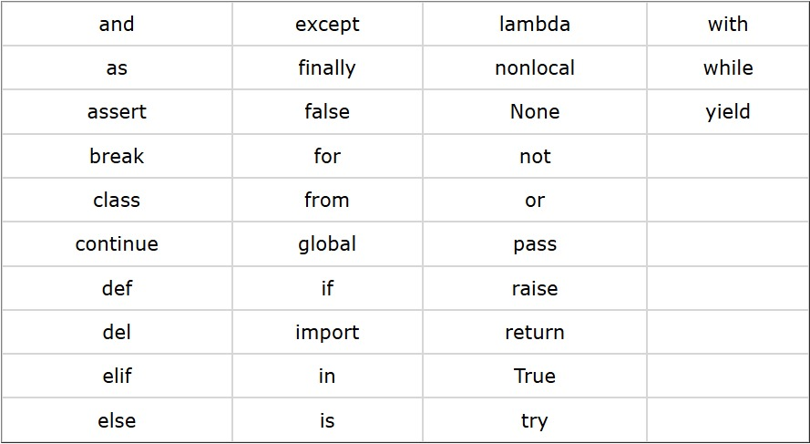
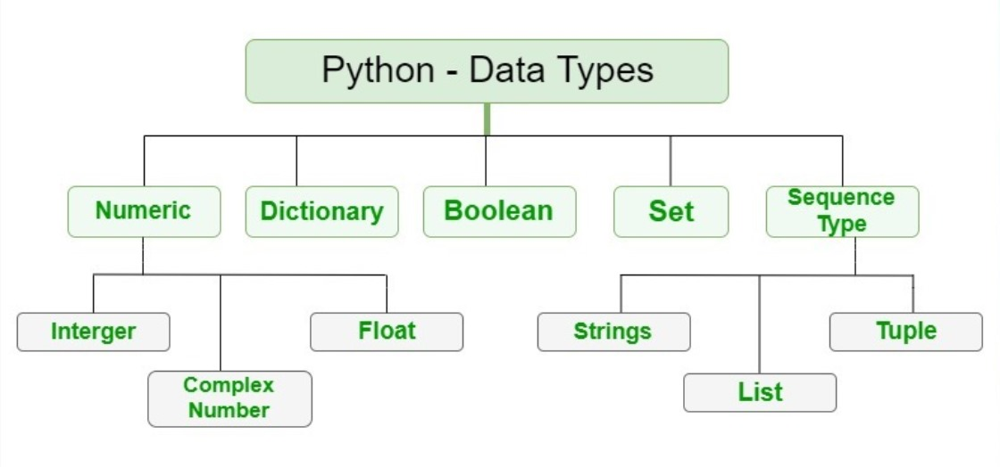
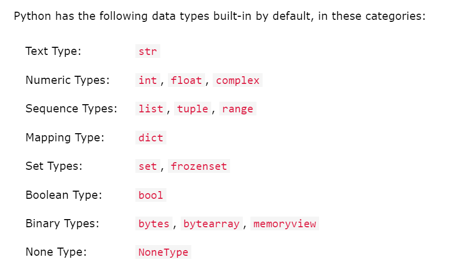
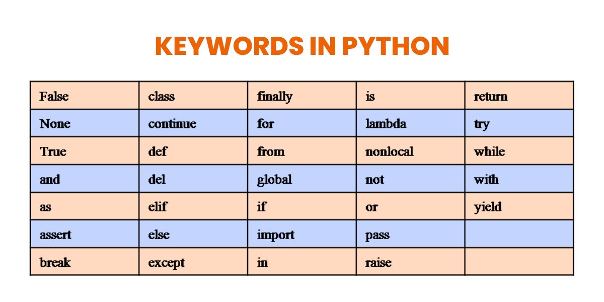

# Python

## Line Structure in Python
>口 Python code is divided into __logical lines__.

>口 Every line is ended by a token called newline.(i.e) Python uses new lines to complete a command.\
  (as opposed to other programming languages which often use semicolons or parentheses).

>口 Python relies on indentation, using whitespace, to define scope (a block of code); such as the scope of 
   loops,functions and classes.\
   (unlike other programming languages that often use curly bracket for this purpose).

→ So a single __logical line__ can consist of one or more __physical lines__.\
→ we can add 2 __physical lines__ into 1 __logical line__ by using \ 

    a = 1\
    + 2
    
→ we can also have 2 __logical lines__ in 1 __physical line__ using ;

    x = 1 ; y = 2

## Python Indentation

>• __Indentation__ refers to the __spaces__ at the beginning of a code line.\
>• Python uses indentation to indicate a block of code.\
>• Python will give you an error if you skip the indentation.\
>• You have to use the __same number of spaces__ in the same block of code,\
   otherwise Python will give you an error.

## Keywords in Python
>

## Data classes(types) in Python
>

Variables can store data of different\
 types and different types can do different things
>

## Getting the Datatype of an object

 You can get the datatype of any object by using the **type()** function\
 (ALL DATATYPES ARE ILLUSTRATED BELOW)
 

>[!TIP]
>x = str("Hello World")\
print(type(x))
>
>## #<class 'str'>

>[!TIP]
>x = int(20)\
print(type(x))
>
>## #<class 'int'>

>[!TIP]
>x = float(20.5)\
print(type(x))
>
>## #<class 'float'>

>[!TIP]
>x = complex(1j)\
print(type(x))
>
>## #<class 'complex'>

>[!TIP]
>x = list(["apple", "banana", "cherry"])\
print(type(x))
>
>## #<class 'list'>

>[!TIP]
>x = tuple(("apple", "banana", "cherry"))\
print(type(x))
>
>## #<class 'tuple'>

>[!TIP]
>x = range(6)\
print(type(x))
>
>## #<class 'range'>

>[!TIP]
>x = {"name" : "John", "age" : 36}  **(OR)**\
x = dict(name="John", age=36)\
print(type(x))
>
>## #<class 'dict'>

>[!TIP]
>x = set({"apple", "banana", "cherry"})\
print(type(x))
>
>## #<class 'set'>

>[!TIP]
>x = frozenset({"apple", "banana", "cherry"})\
print(type(x))
>
>## #<class 'frozenset'>

>[!TIP]
>x = bool(5)\ **(OR)**\
x = True\
print(type(x))
>
>## #<class 'bool'>

>[!TIP]
>x = b"Hello"  **(OR)**\
x = bytes(5)\
print(type(x))
>
>## #<class 'bytes'>

>[!TIP]
>x = bytearray(5)\
print(type(x))
>
>## #<class 'bytearray'>

>[!TIP]
>x = memoryview(bytes(5))\
print(type(x))
>
>## #<class 'memoryview'>

>[!TIP]
>x = None\
print(type(x))
>
>## #<class 'NoneType'>

> [!IMPORTANT]
>#### BASED ON FLOATS
>

> [!IMPORTANT]
>#### FEW ESCAPE SEQUESCES 
> | sequence | use |
> | --- | --- |
> | \n | used for newline |
> | \a | used for alert sound |
> | \b | for backspace character |
> | \f | for form feed |
> | \r | for carriage return |
> | \t | tab space horizontal |
> | \v | tab space vertical |
> | \ooo | character of octal value oo |
> | \xHH | character of Hexa decimal value HH |

